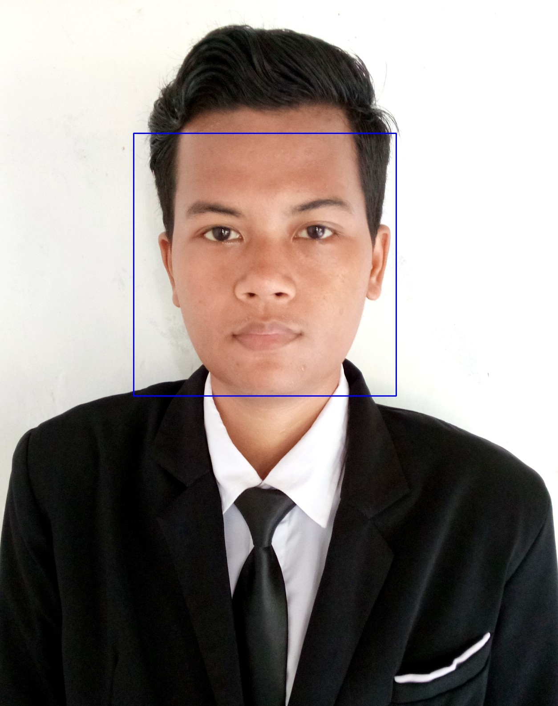

# 🧠 Aplikasi Web Deteksi Wajah

Aplikasi web sederhana untuk mendeteksi wajah pada gambar yang diunggah menggunakan **Flask**, **OpenCV**, dan model **Haarcascade**.

## ✨ Fitur

- Unggah gambar dari perangkat pengguna
- Deteksi wajah secara otomatis pada gambar
- Menampilkan hasil deteksi dengan kotak di sekitar wajah
- Antarmuka responsif menggunakan Bootstrap

## 🧰 Teknologi yang Digunakan

- Python 3
- Flask
- OpenCV (cv2)
- Haarcascade (haarcascade_frontalface_default.xml)
- Bootstrap 5

---

## 📸 Tampilan Aplikasi



---

## ⚙️ Instalasi & Menjalankan Aplikasi

Ikuti langkah-langkah berikut untuk menjalankan aplikasi ini di komputer Anda:

### 1. Clone Repository

```bash
git clone https://github.com/harunid12/flask-face_detection.git
cd flask-face_detection
```

### 2. Buat dan Aktifkan Virtual Environment

```sh
python -m venv venv
source venv/bin/activate  # Mac/Linux
venv\Scripts\activate     # Windows
```

### 3. Install Dependencies

```sh
pip install flask opencv-python
```

### 4. Jalankan Aplikasi

```sh
python app.py
```

Akses aplikasi di `http://127.0.0.1:5000/`

## 📂 Struktur Folder

```
/project-root
│── static/                # File CSS, JS, AdminLTE assets
│── templates/
│   ├── index.html
│── app.py                # File utama Flask
│── haarcascade_frontalface_default.xml       # model deteksi
│── README.md               # Dokumentasi
```
